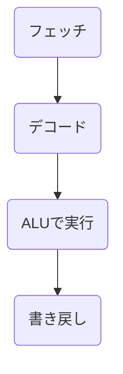

# CPU

「CPU（Central Processing Unit, 中央処理装置）」はコンピュータの「頭脳」にあたる部分で、**命令を解釈し、データを処理し、結果を制御する** 役割を持ちます。基本的な構造はシンプルですが、現代 CPU はこれを高度に並列化・高速化しています。

## ✅ CPUの基本構造（フォン・ノイマン型コンピュータのモデル）

1. **制御装置 (Control Unit; CU)**
   * メモリから命令を取り出し（フェッチ）、解読（デコード）し、各回路に「何をすべきか」を指示する部分。
   * 命令の流れを管理する「司令塔」。
2. **演算装置 (Arithmetic Logic Unit; ALU)**
   * 算術演算（加算・減算など）や論理演算（AND, OR, NOTなど）を実行する。
   * 浮動小数点演算を扱う **FPU（Floating Point Unit）** を別に持つことも多い。
3. **レジスタ (Registers)**
   * CPU内部にある超高速の小さな記憶領域。
   * 命令実行のためのデータ、アドレス、状態フラグなどを一時的に保存する。
   * 種類：
     * 汎用レジスタ（計算やデータ保持用）
     * プログラムカウンタ（次に実行する命令のアドレス）
     * ステータスレジスタ（演算結果のフラグ: ゼロ/キャリー/オーバーフローなど）
4. **クロック (Clock)**
   * 一定のリズムで「命令実行のタイミング」を刻む信号源。
   * クロック周波数が高いほど処理速度は基本的に速い。
5. **バス (Bus)**
   * データやアドレス、制御信号をやり取りする通路。
   * 種類：
     * データバス（数値や命令データのやりとり）
     * アドレスバス（メモリアドレス指定）
     * 制御バス（読込/書込などの制御信号）

> CU→メモリから命令を取り出す＝フェッチ、解読＝デコードし、各回路に何をすべきか指示する。
>
> ALU→演算を実行する。
>
> レジスタ→CPU内部の高速な記憶領域。
>
> クロック→信号源。
>
> バス→データやアドレス、制御信号をやり取りする通路。データバス、アドレスバス、制御バス

## ✅ 動作の流れ（命令実行サイクル）

1. **フェッチ (Fetch)** : メモリから命令を読み込む
2. **デコード (Decode)** : 命令を解析し、必要な操作を決定
3. **実行 (Execute)** : ALU で演算、メモリからデータ取得、レジスタへ格納など
4. **書き戻し (Write-back)** : 結果をレジスタやメモリに保存

このサイクルがクロックごとに繰り返され、プログラムが進行します。

## 現代 CPU の発展的な仕組み

* **パイプライン処理**

  → 複数の命令を分割して同時並行的に処理（工場の流れ作業のイメージ）。
* **スーパースカラ**

  → 複数の命令を同時に実行可能（並列処理）。
* **アウトオブオーダ実行**

  → 命令の依存関係を見て、順番を入れ替えて効率良く処理。
* **キャッシュメモリ**

  → よく使うデータをCPU内部の超高速メモリに保持（L1/L2/L3 キャッシュ）。
* **マルチコア構造**

  → 複数のCPUコアを1チップ上に搭載し、並列で処理。

## ✅ まとめ（試験回答用にシンプルに）

> CPUは「制御装置」「演算装置」「レジスタ」を中心に構成され、クロックとバスで外部と連携する。基本動作は「命令フェッチ → デコード → 実行 → 書き戻し」のサイクルで進み、現代CPUはパイプライン・キャッシュ・マルチコアなどを用いて高速化している。
>
