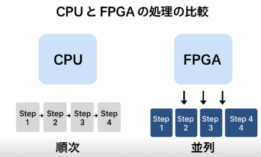

# マイコンとSoCの違い

Arduino のようなマイコン（MCU）と SoC（System on Chip）では、 **コードの最適化の考え方や対象が大きく異なります** 。

整理してみます。

---

## 1️⃣ マイコン（Arduino など）のコード最適化

### 特徴

* CPU が単独で動作し、プログラムを順次実行する
* メモリが少ない（SRAM やフラッシュが限られる）
* 外部ペリフェラル（GPIO, ADC, PWM, UART など）を CPU が直接制御

### 最適化のポイント

1. **実行速度の改善**
   * 計算量の少ないアルゴリズムを選ぶ
   * ループ回数や条件分岐を減らす
   * 割り込み処理やタイマーを活用して効率化
2. **メモリ使用量の最適化**
   * グローバル変数や配列サイズを抑える
   * 文字列は `PROGMEM` に置く
   * 不要なライブラリや関数を削除
3. **消費電力の最適化**
   * スリープモードを活用
   * CPU 動作クロックを下げる

💡 要するに **「限られた CPU とメモリで効率的に順次処理させる」** のがポイント。

---

## 2️⃣ SoC（FPGA + CPU コア、Raspberry Pi など）のコード最適化

### 特徴

* CPU が FPGA や専用アクセラレータと組み合わさっている場合が多い
* 並列処理やハードウェアアクセラレーションが可能
* 複数のメモリ領域（オンチップ SRAM, DDR, キャッシュ）が存在

### 最適化のポイント

1. **並列処理の活用**
   * FPGA 部分でデータを同時に処理
   * CPU で逐次処理する部分は必要最小限に
2. **FPGA リソース効率化**
   * LUT, FF, BRAM, DSP の使い方を工夫
   * 計算回路をパイプライン化
   * 無駄な演算やメモリアクセスを減らす
3. **CPU と FPGA の分担**
   * 重い演算やリアルタイム処理は FPGA
   * 制御や条件判断は CPU
4. **メモリやバスの効率化**
   * メモリ転送をブロック単位で行いバスを節約
   * キャッシュやバッファを活用

💡 要するに **「並列処理と専用ハードの強みを最大限に活かす」** のがポイント。

---

## 3️⃣ 両者の大きな違い

| 項目         | マイコン (Arduino)           | SoC / FPGA + CPU                         |
| ------------ | ---------------------------- | ---------------------------------------- |
| コードの性質 | 順次実行                     | 並列実行 + 順次制御                      |
| メモリ       | 限定的                       | 豊富（オンチップ/外部）                  |
| 最適化対象   | CPU 命令の効率、メモリ使用量 | ハードリソースの効率、並列化、タイミング |
| 処理         | 主にソフトウェア             | ソフト + ハード (FPGA)                   |
| 例           | PWM 制御、ADC 読み取り       | 画像処理、信号処理、AI 推論              |

---

💡 **まとめ**

* マイコンの最適化 → **ソフトウェア効率化重視**
* SoC / FPGA の最適化 → **ハードリソース効率 + 並列化重視**

---


## FPGAの方が早い理由

FPGA の処理が CPU より高速に感じられるのには、**根本的なアーキテクチャの違い**があります。順を追って説明します。

---

## 1️⃣ CPU の処理の仕組み

* CPU は **順次実行型**
  * プログラムは「命令列」としてメモリに置かれ、1命令ずつ実行される
  * 近年の CPU はパイプラインやマルチコアで並列化しているが、あくまで **命令レベルの順次処理**
* 演算は ALU（算術論理演算器）で順番に行う
* メモリアクセスがボトルネックになることが多い

💡 CPU は「柔軟性が高いけど、同時に大量のデータを処理するのは不得意」

---

## 2️⃣ FPGA の処理の仕組み

* FPGA は **回路を自由に配置できるハードウェア**
* 命令を順次解釈するのではなく、**回路自体が同時に動作**する
* 並列化が簡単で、信号経路に沿って複数の演算が同時に実行できる

### 具体例

* 4つの加算を CPU でやる場合
  ```text
  a+b -> c+d -> result  (順次)
  ```
* FPGA なら
  ```text
  a+b  c+d -> 並列に計算
  ```
* N 個のデータがあれば N 個同時に処理可能

---

## 3️⃣ 高速の理由まとめ

| 理由           | CPU                            | FPGA                                           |
| -------------- | ------------------------------ | ---------------------------------------------- |
| 実行方法       | 順次実行                       | 並列実行                                       |
| クロック       | 高速（数 GHz）                 | CPUより低速でも並列化で高速化                  |
| メモリ依存     | 命令フェッチやキャッシュに依存 | 回路に直接データを流すため高速                 |
| アクセラレータ | 別ハード必要                   | FPGA内部に専用回路（DSP, LUT, BRAM）で直接実装 |

💡 つまり **CPU は柔軟性優先、FPGA は専用回路を直接実装して並列処理するので高速** ということです。

---

## 4️⃣ 例：画像フィルタの処理

* CPU では 1 ピクセルずつ順番に計算
* FPGA では 画像の複数ピクセルを同時にフィルタ処理できる
* 結果として「CPU より桁違いに速くなる」

> 高速な理由
>
> FPGAは処理順次処理ではなく回路自体が同時に動作する。→並列化が簡単で、並列化が簡単で複数の演算を同時実行可能
>
> メモリはCPUは命令フェッチやキャッシュに依存するが、FPGAは直接データを流す。

イメージは以下通り。


