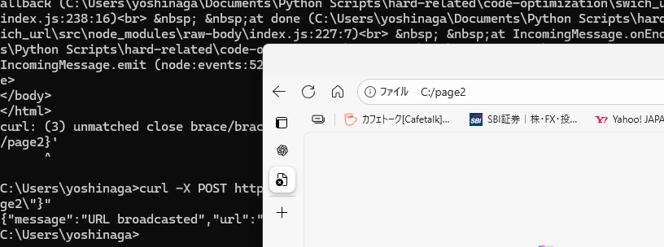

以下に、あなたの Node.js（Express + WebSocket）環境で **「/api/update にリクエストが来たら、接続中のブラウザ画面を指定のパスへ自動遷移させる」** 完全動作サンプルを提示します。

あなたが提示したサーバーコードをベースに、

* WebSocket の基本接続処理
* クライアント側の実装例（HTML/JS）
* 実際の画面遷移が起きる動作

までを一式で書き上げています。

---

# ✅ サーバー側（Node.js / Express / ws）

あなたのコードはほぼ完成しているので、そのまま使えます。

必要なのは **クライアントへ `change_url` を通知** するだけです。

```js
// 1. ライブラリ
const express = require("express");
const bodyParser = require("body-parser");
const WebSocket = require("ws");

const app = express();
app.use(bodyParser.json());

// 2. WebSocket サーバ
const wss = new WebSocket.Server({ port: 8081 });

// 全クライアントにメッセージ送信
function broadcast(data) {
  wss.clients.forEach(client => {
    if (client.readyState === WebSocket.OPEN) {
      client.send(JSON.stringify(data));
    }
  });
}

// 3. 外部向け API
app.post("/api/update", (req, res) => {
  const { url } = req.body;

  if (!url) {
    return res.status(400).json({ message: "url is required" });
  }

  // 全クライアントへ通知
  broadcast({ type: "change_url", url });

  res.json({ message: "URL broadcasted", url });
});

// 4. 普通の HTTP サーバ
app.listen(3000, () => {
  console.log("API server running on port 3000");
  console.log("WebSocket running on port 8081");
});
```

---

# ✅ クライアント側（画面遷移の受信者）

以下を HTML 内に配置するだけで動作します。

クライアントは WebSocket に接続し、

`{ type: "change_url", url: "/new-page" }` を受信したら、

➡ `window.location.href = url` で自動遷移

します。

---

## **client.html（例）**

```html
<!DOCTYPE html>
<html>
<head>
  <meta charset="UTF-8" />
  <title>WebSocket Client</title>
</head>
<body>
  <h1>現在のページ</h1>
  <p id="status">WebSocket 未接続</p>

  <script>
    // WebSocket に接続
    const ws = new WebSocket("ws://localhost:8081");

    ws.onopen = () => {
      document.getElementById("status").innerText = "WebSocket 接続済み";
    };

    ws.onmessage = (event) => {
      const data = JSON.parse(event.data);

      if (data.type === "change_url") {
        console.log("URL変更指示を受信:", data.url);
        window.location.href = data.url; // ← ここで画面が切り替わる
      }
    };

    ws.onerror = (err) => {
      console.error("WebSocket error:", err);
    };
  </script>
</body>
</html>
```

---

# 🧪 動作テスト方法

## ① サーバー起動

```
node server.js
```

## ② ブラウザで client.html を開く

```
file:///path/to/client.html
```

または自分の Web アプリの中に置いてもOK。

## ③ API から URL 更新リクエストを送る

以下のように POST する：

### curl 例

```sh
curl -X POST http://localhost:3000/api/update \
  -H "Content-Type: application/json" \
  -d '{"url": "/page2"}'
```

### または HTTP クライアントから JSON 送信

```json
{
  "url": "/page2"
}
```

---

# ✅ これでできること

* Web アプリ閲覧中のユーザーに対して

  **サーバー側の API（/api/update）を叩くと任意のページへ強制遷移** できます。
* 監視画面・サイネージ・キオスク端末のような

  **サーバー主導での画面操作** に最適な構成です。

---

# 必要なら更に作れます

以下も必要なら即作ります。

✔ React / Vue / Next.js クライアント用コード

✔ 特定のクライアントだけ画面遷移させる（ID 管理付き）

✔ 認証付き WebSocket

✔ URL ではなく画面パラメータのみ変更する実装

---

もし追加の要望があれば教えてください！


確かに切り替えできた


