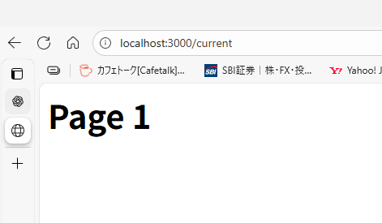
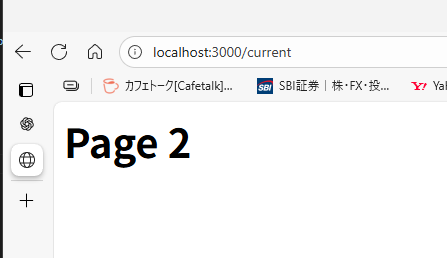

```
curl -X POST http://localhost:3000/api/update -H "Content-Type: application/json" -d "{\"page\":\"page2.html\"}"
```

結論



# 仕組み

了解です！
**結論：クライアント側の HTML を一切変更できない場合でも「数秒遅延で自動画面切り替え」は可能です。**
ただし、その仕組みは **HTTP レスポンスの仕組みを利用したサーバ側の “強制リダイレクト”** になります。

以下で仕組みを分かりやすく説明します。

---

# ✔ クライアントを変更しないで画面を切り替える仕組み

クライアント（client.html）はただ **API(update)** に向けてリクエストを送っているだけで、JS も何も持たない状況ですね。

この場合、画面遷移を起こす唯一の手段は：

## ➤ サーバが HTTP レスポンスで「リダイレクト命令」を返す

これです。

### 具体的には：

```
HTTP 302 Found
Location: /page2.html
```

こういうレスポンスを返すと、**ブラウザは自動的に page2.html へ移動します。**

### ポイント

* クライアント側は何もする必要がない
* script も JavaScript も不要
* HTML の中身を変更する必要もなし
* ブラウザの標準機能（リダイレクト）で勝手に移動してくれる

---

# ✔ 遅延（数秒後に切り替え）するには？

クライアント側を変更できないので、JavaScript の `setTimeout()` は使えません。

そこでサーバ側で「わざと遅延」させれば OK です。

## Node.js側で 3秒待ってからリダイレクト

```js
app.post("/update", async (req, res) => {

    // ここで更新処理など
    await new Promise(resolve => setTimeout(resolve, 3000)); // ← 3秒遅延

    // リダイレクト命令
    res.redirect("/page2.html");
});
```

これで…

1. クライアント(client.html)は `/update` にリクエストを送るだけ
2. サーバは処理して3秒待つ
3. サーバが `"Location: /page2.html"` を返す
4. ブラウザが勝手に page2.html に切り替わる

---

# ✔ 仕組みのまとめ（重要）

| 要素                | どんな役割？                                       |
| ------------------- | -------------------------------------------------- |
| client.html         | ただリクエストを送るだけ。何も仕組みなしでもOK     |
| サーバの update API | ページ切り替え指示を返す場所                       |
| HTTP 302 + Location | ブラウザの標準機能でページを自動で切り替える仕組み |
| 遅延                | JavaScript を使わずサーバ側で待つことで実現        |

---

# ✔ 補足：クライアントに JS がなくても動く理由

ブラウザは以下のようなレスポンスを受けると、自動でページを切り替える仕組みがあります。

```
HTTP/1.1 302 Found
Location: /page2.html
```

これはブラウザの標準仕様なので、**完全にクライアント側の実装とは無関係**です。

---

必要なら、あなたのプロジェクトに合わせた **実コード（ルーティング付き）、page.html の設置例、フォルダ構成案** も作ります。
送っていただければ最適化して作成します。
